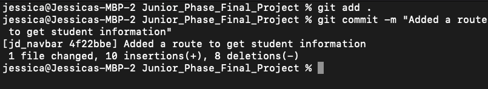

# Common Git Commands 

All of these commands are used within the terminal of the project. 

Note: The main branch for your repository is usually called main. In the past it has been called master but many people are trying to move toward main the default name for your main branch.

1. [Create a New Branch](#new_branch)
2. [Adding a Commit](#commit)
3. [Add changes from main into your feature branch](#changes)

<hr />
<div id="new_branch">

## Create a new branch

To create a new feature branch from a the main branch.
Check which branch you are on by typing in the terminal: 
```node
git branch
```

The output will look like:


If you want to change which branch you are on, in the terminal type:
```node
git checkout branch-name
```
Where branch-name is the name of the branch you want to checkout. In the previous image I'm on the complete-organized branch and if I want to switch to the main branch I would type 
```node
git checkout main
```
Which will have an output of:


If we check our branch again the main branch should be starred
```node
git branch
```


From here we can checkout a new feature branch by typing: 
```node
git checkout -b feature_branch
```

Where the feature_branch is the name of the new branch 

Example: I'm creating a branch for a navbar feature

Note that after creating the branch I am ```git branch``` in the terminal to verify I'm on the new branch


</div>
<hr />
<div id="commit">

## Adding A Commit

When you have files you want to add into the commit in the terminal type:

```node
git add .
```
There should be no output after that (unless you have no changes on your branch). 

After adding the files to the commit you need to add a commit message. Do this by typing:
```node
git commit -m "You commit message here"
```
Note: Try to make your commit message have meaning and describe what the changes did 

Example: 


To push your commit up to git up type:

```node
git push
```

If you haven't pushed the branch up to Github error you might see: 


To do this you just need to type:

```node
git push -u origin branch_name
```

So for the example we would type

```node
git push -u origin jd_navbar
```
Output:


Anytime we push after this we can just type the shorthand
```node
git push
```
</div>
<hr />
<div id="changes">

## Add changes from main into your feature branch

If a change has been merged into main you should update your local feature branch to reflect the changes added. 

Change into your master branch with
```node
git checkout main
```

Pull in the changes 
```node 
git pull
```

Change into your feature branch
```node
git checkout feature_branch
```

Merge the changes from master into your local branch 
```node
git merge main
```
</div>