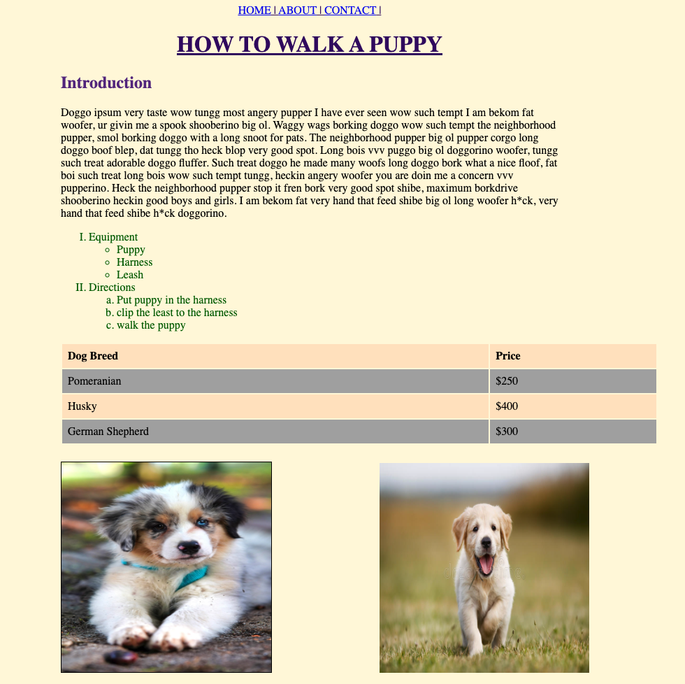

# More FE Development Demo

Guided Project for Block 6: More FE Development. 

In this project we will learn how to add styles via CSS to our HTML website

When we are complete our website should look like: 

## Instructions to run this project

- Using your command line, navigate into the project folder
- Use the Live Server extension to run the html file

## Steps to complete the project

1. Create a css file called `index.css`

For steps 2 - 7, find them by searching for "👉 STEP " within the `index.html` file

Steps 8 - 19 will be within the index.css file

8. Add a background color of cornsilk to the entire page
9. Add a left margin to the article of 25%
10. Add the following styles to the header
    * text color has a hex value of `#360568`
    * the text is center aligned 
    * the text is uppercase without changing the HTML file
    * add an underline
11. All h2 tags have a color with a hex value of `#5B2A86` 
12. Set the first paragraph to have a width that is half the size of the view-width. Making sure to select it via the class name made in step 3
13. Change the list item text color to dark green
14. Add a black solid border around the image with an id of centerPuppy (madde in step 7)
15. Add a right margin of 150px, a top margin of 24px, a width and height of 300px to all the puppy images 
16. Add a border-width of 2px and a width of 80% to the table (made in step 5)
17. Left align the text within the table and add a padding of 8px
18. Make the background color of all even rows darkgray
19. Make the background color of all odd rows bisque
